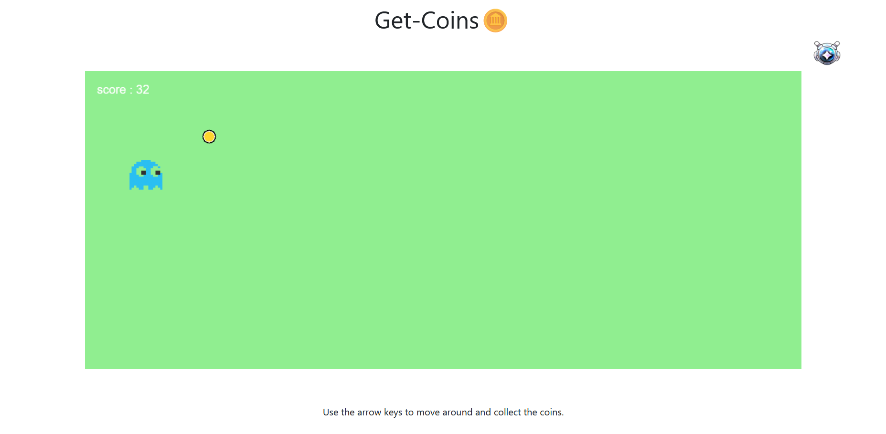

# Get-Coins

Simple game with Phaser (collect the coins).

## Tools used

- HTML 
- JavaScript 
- Phaser <a href="https://phaser.io/">Go to site</a>

## Run the game

- make sure you have python installed on your computer.
- then run the command 'python -m http.server 8888' at the root of the projet 
    (you can replace 8888 by any number of a port you want, just make sure the port is available).
- then navigate to http://localhost:8888/ (eventually replace 8888 by the number of the port you choose).

## Game

## Author

Luljn.